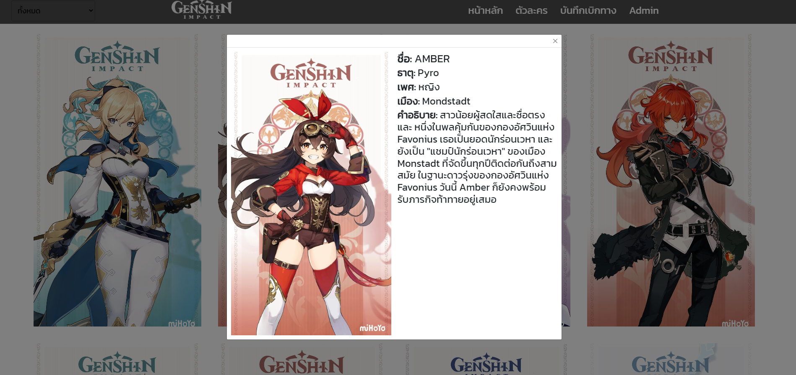
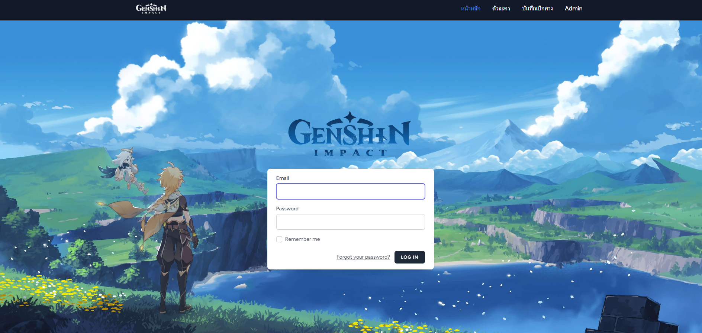
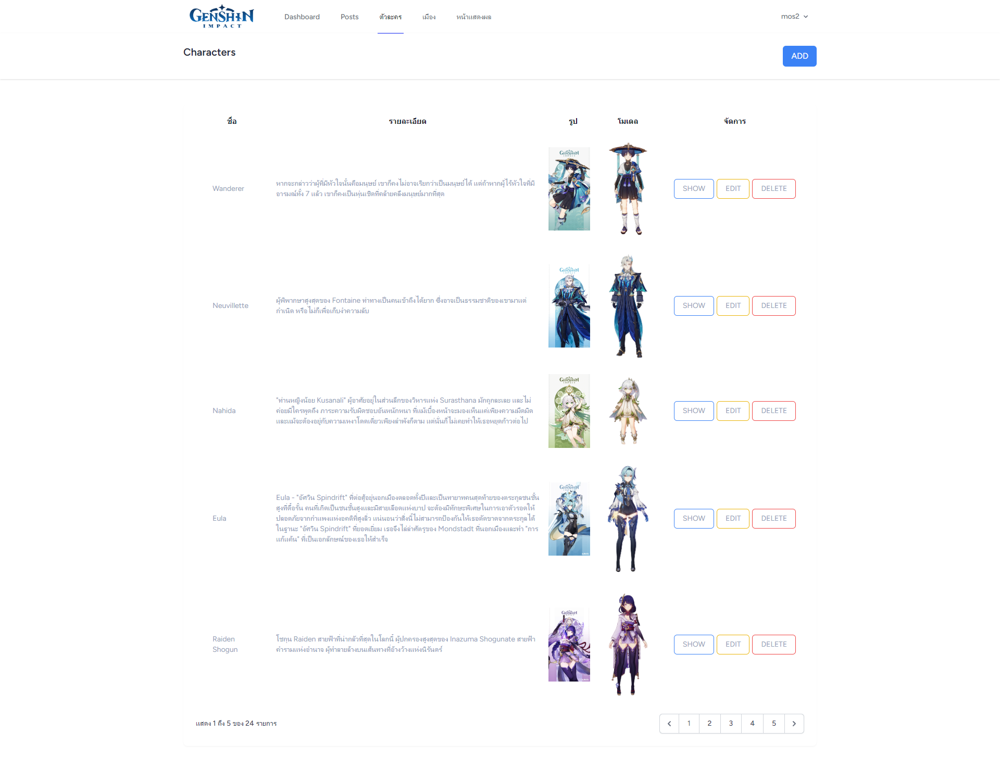
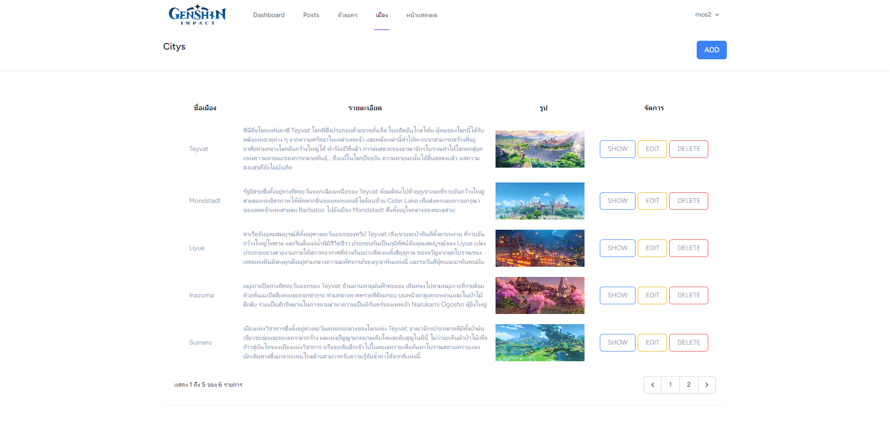

# Laravel+tailwind css+bootstrap# Genshin impact
* Natdanai Wongsa
### <ins> </ins> 


### <ins> </ins> 


### <ins>  </ins> 


### <ins> </ins> 


### <ins> </ins> 


### <ins>  </ins> 


### <ins>  </ins> 


### <ins>  </ins> 


# Laravel 10 CRUD and Image Upload Tutorial with Laravel Breeze and Repo Example
This is an implementation of Laravel CRUD tutorial. A blog about this can be found here: [Laravel 10 CRUD and Image Upload Tutorial with Laravel Breeze and Repo Example | Fajarwz](https://fajarwz.com/blog/laravel-10-crud-and-image-upload-tutorial-with-laravel-breeze-and-repo-example/).

## Installation

### Composer Packages 
```
composer install
```

## Configuration

### Create `.env` file from `.env.example`
```
cp .env.example .env
```

### Generate Laravel App Key
```
php artisan key:generate
```

### Database Integration
1. Open `.env` file
2. Create a database and connect it with Laravel with filling the DB name in `DB_DATABASE` key
3. Adjust the `DB_USERNAME`
4. Adjust the `DB_PASSWORD`

### Migrate the Database Migration and Run the Seeder
```
php artisan migrate
```

## Run App
Install NPM packages first
```
npm install
```

Run local web server
```
php artisan serve
```

Open new console and run the app with Vite
```
npm run dev
```
